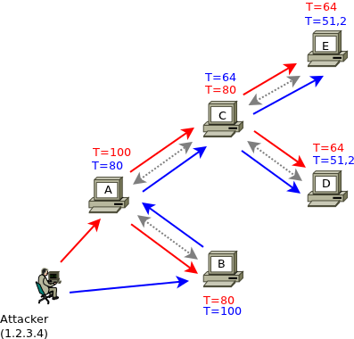

Introduction
************
About fail2ban-p2p
==================

fail2ban-p2p is a programm that can be used together with 
`fail2ban <http://www.fail2ban.org>`_  to **distribute information about
attackers using a p2p/f2f network.**  Like fail2ban it is written in
python. fail2ban-p2p is in an **early stage of development**, please be
prepared for bugs and if you find some, let us know (open a
`ticket <https://github.com/mmunz/fail2ban-p2p/issues>`_).

Every node in a fail2ban-p2p network is connected to at least one other node
("friend"). When fail2ban detects an attacker it launches an action (e.g.
block the attackers IP with iptables). To work together with fail2ban-p2p
fail2ban is configured to launch another action once an attacker is identified:
fail2ban sends the attackers IP address to the locally running instance of
fail2ban-p2p. fail2ban-p2p then redistributes this information about the attacker
to all friends which are online. fail2ban-p2p on the friends nodes writes this
information to a logfile that is watched by fail2ban. Now Fail2ban on the friends
node itself can launch an action (e.g. block that attacker IP).

Fail2ban-p2p only handles the distribution of attacker IPs, while fail2ban is used
to detect attackers and launch actions (e.g. ban the attackers). Friends redistribute
received messages to their friends and so on, until the whole network is informed
about that attacker.

There is a configurable trustlevel value (a percentage, the default is 80%) that is
applied to forwarded messages. Trustlevel decreases the more hops the node that
initially detected the attacker is away. In other words:
**You trust your own direct "friends" more than their friends.**

To ensure fail2ban-p2p processes only messages that were received by direct friends,
all messages are signed with your private key and can be verified by the friend
who receives the message. That means when you configure a new friend you also
have to exchange public keys with him.

The following graphic may help to better understand how messages are distributed
in a fail2ban-p2p network:

For an in-depth explanation of this graph see :ref:`design`

Installation
============

Fail2ban-p2p can be installed from source code (tarball or svn).
We also provide packages for **Debian**. See :ref:`install` for installation
instructions.

Configuration
=============

To be able to use fail2ban-p2p you need to configure your node and
exchange public keys with your friends. See :ref:`configuration` for
details how to do this.

Mailinglist
===========

For help/discussion please subscribe to the fail2ban-p2p mailing list at http://mailman.rz.uni-augsburg.de/mailman/listinfo/fail2ban-p2p
